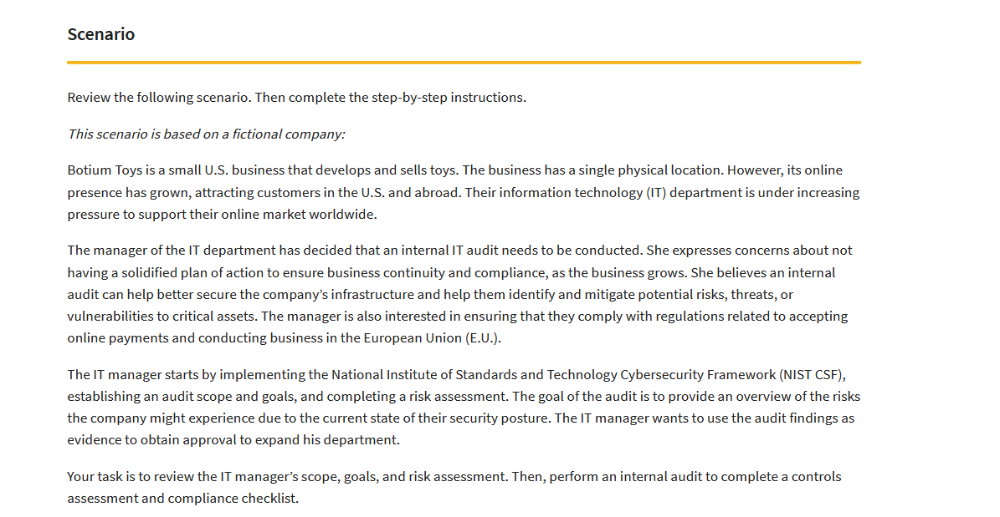

# Security-audit
## Security audit made in Google Cybersecurity Certificate
In the Google Cybersecurity Certificate I got a task to complete a security audit to practice my skills in that area.

I was given the following:

+ Scenario
+ Botium Toys Audit scope and goals
+ Botium Toys Risk assessment

In shortage there was a fictional company "Botium Toys" that had one physical location but it's online shop expanded really quickly even in the EU.

After researching the scenario and gathering information from "Botium Toys Audit scope and goals" and "Botium Toys Risk assessment" I made a Controls assessment and Compliance checklist.

As a summary a made a file Conclusion to sum up all the data. I made a recommendations for "Botium Toys" company to make their security stronger.

Everything was made as an "portfolio activity" in Google Cybersecurity Certificate.

